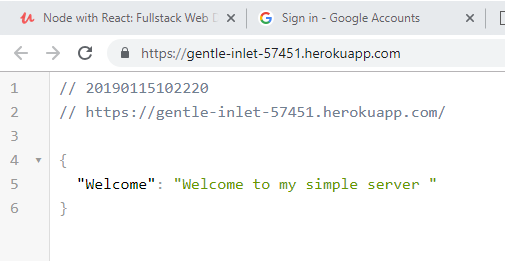

# Server Side Architecture #
Express - library that runs in the Nodejs runtime.  Has helper functions for basic HTTP servers to handle requests.

### Part I - Setting Up Project and adding the Express Server (Local) ###
- set up fresh project

		npm init

- use project defaults (hit enter)

		Press ^C at any time to quit.
		package name: (server2)
		version: (1.0.0)
		description:
		entry point: (index.js)
		test command:
		git repository:
		keywords:
		author:
		license: (ISC)

	About to write to C:\Users\himon\dropbox\gitrepos\NodeWithReact-SG\myFullStack2\server2\package.json:
	
		{
		  "name": "server2",
		  "version": "1.0.0",
		  "description": "",
		  "main": "index.js",
		  "scripts": {
		    "test": "echo \"Error: no test specified\" && exit 1"
		  },
		  "author": "",
		  "license": "ISC"
		}
	
	
		Is this OK? (yes)

- install express

		npm install --save express

- wire the express server (see code -  index.js)
- run the code

		node index.js

- check browser for output

### Part II - Passport and Google Strategy ###

There are a lot of other minor steps that should be documented here. 
1. Pointers to Google documentation.
2. Google IDs
3. Setting up a google account for the first time.
4. Setting Up Projects.
5. Overview of passport library

- **passport.js**: helper library middleware to handle authentication process in Express server apps
[http://www.passportjs.org/](http://www.passportjs.org/)

- **passport strategy**: helper library middleware for authenticating a specific strategy method

 
- **google strategy**

		npm install --save passport passport-google-oauth20

- **Google OAuth screen navigation**

Click the blue manage button. It will take you to a screen with a create credentials button.
Don't click on this button, but instead click on the "Credentials" tab on the left. 

<figure></figure>

That will take you to an APIs Credential screen.
Click on the "create credentials" drop-down and select "Create OAuth client ID"

<figure></figure>

On the "OAuth" screen you need to choose the "web application" option.

<figure></figure>

### Part III - Attach MongoDB  ###

### Part IV - Connect to Production Server on Heroku

- from bash issue the following command

This will (eventually) open the server app on heroku  (go back and review how we set this up)

 	heroku open

- Copy the url address and use it in the google redirect setting in **Part II** (above).

In this case:

	 https://gentle-inlet-57451.herokuapp.com/

