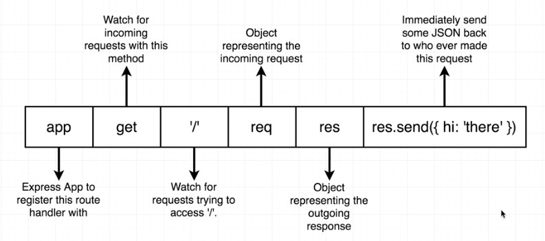

# Server Side Architecture #
Express - library that runs in the Nodejs runtime.  Has helper functions for basic HTTP servers to handle requests.

### Part I - Setting Up Express Server (Local) ###
- set up fresh project

	npm init

- use project defaults (hit enter)

	Press ^C at any time to quit.
	package name: (server2)
	version: (1.0.0)
	description:
	entry point: (index.js)
	test command:
	git repository:
	keywords:
	author:
	license: (ISC)
	About to write to C:\Users\himon\dropbox\gitrepos\NodeWithReact-SG\myFullStack2\server2\package.json:

	{
	  "name": "server2",
	  "version": "1.0.0",
	  "description": "",
	  "main": "index.js",
	  "scripts": {
	    "test": "echo \"Error: no test specified\" && exit 1"
	  },
	  "author": "",
	  "license": "ISC"
	}

	Is this OK? (yes)

- install express

	npm install --save express

- wire the express server (see code -  index.js)
- run the code

	node index.js

- check browser for output

### Part II - Passport and Google Strategy ###

### Part III - Attach MongoDB  ###
